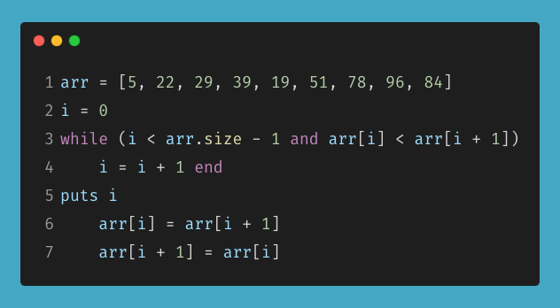

### ATA1 - Workbook<br>Yuusuke Nagata

#### Q1.
##### "Research the development of the internet from 1980 to today. You must describe at least FIVE key events in the development of the internet. You can refer to events, people of significance, or technologies and how they have changed over time."
 1. 1983, the Domain System  Name (DNS) was established by Paul Mockapetris. He and his team at the University of South California simplified the ARPAnet's holding name system using IP to a dynamic naming system. As a result, domain names are easily identifiable by any users and this has lead to become the original Internet Standards we see today.

2. Stephen Wolff, known as one of many fathers of the Internet connected the supper computing centers owned by the government to regional networks in the U.S and international education networks. This was the first open computer to ever be established when Wolff took over the NSFNet program in 1986. Since then everyone has access to a computer either for personal or public use.  

3. As internet grew between North American and the Western Europe continents. A global connector by the name Professor Kilnam Chon, had an extensive role in promoting Internet policies, science, and advancement led to the Internet's growth in Asia. Being SDN the first internet to be developed in 1982, his work later motivated others by his groundbreaking work to support the Internet's continued development in the region and later become the hub of internet usage.

4. The "@" sign used in every ones email was created by Raymond Tomlinson. Since then he was put into head position of creating the required services in network electronic mail, setting a standard format for email messages, and designing a tool for creating and reading email. 

5. John Cioffi, the creator of Digital Subscriber Line (DSL) used to transmit data over a regular phone line. Compared to Dial-UP which was very unreliable as it disrupts the internet usage when a call is received. However DSL had different frequencies for phone and data which made made it through the development of reliable internet usage which "account for about 98% of the world’s more than 500 million DSL connections."
<br>

#### Q2.
##### "Define the features of the following technologies that are essential in terms of the development of the internet:"
 - ##### packets
 - ##### IP addresses (IPv4 and IPv6)
 - ##### routers and routing
 - ##### domains and DNS

###### Explain how each technology has contributed to the development of the internet.

##### 1. Packets:
A packet is a small amount of data sent over a network, such as a LAN or the Internet. Each packet includes a source and destination as well as the content (or data) being transferred. Leonard Kleinrock who theorised packets switching in July 1961 later became internets data transfers. Unlike circuits, packets was much more feasible of communications.  

##### 2. IP address (IPv4 and IPv6):
Internet Protocal (IP) address is a main set of rules that governs the exchange or transmission of data between devices on separate networks. Different machines, routers, and websites all need to be distinguished on the internet. IP addresses are a crucial part of how the internet operates and offer a means of doing so.
- IPv4 which is a 32bit address only allows 4b unique address compared to IPv6 that is on a 128bit address that allows a substantial amount of unique address far greater than the previous version.

##### 3. routers and routing:
A router is a software program that selects a path for data to be transmitted from a source to a destination known as a router, a special system that performs routeing. When a devices sends a data into the internet The packets are routed using routeing algorithms. The routeing algorithm is a piece of software that decides the most effective route for packet transmission. The router is a vital component of today's business networks, serving as a link to both the Internet and other networks.

##### 4. Domains and DNS:
DNS is the backbone of the Internet's operation. When you type a domain name into your browser, your machine consults a DNS server to determine the IP address associated with it. This is essential to which DNS ensures that the Internet are both user-friendly and efficiently loading the content that users request.
<br>

#### Q3.
##### Define the features of the following technologies that are essential in terms of the development of the internet:
 - TCP
 - HTTP and HTTPS
 - web browsers (requests, rendering and developer tools)

###### Explain how each technology has contributed to the development of client and server communication over the internet (50 - 150 words for each technology)

##### 1. TCP:
TCP/IP was developed to link several networks to form the Internet. This protocol suite specifies the packet format, as well as a flow-control and error-recovery function, to enable hosts to recover quickly from network errors. Unlike NCP, which allowed hosts on a single network to communicate, TCP/IP was created to link multiple networks together to form the Internet.

##### 2. HTTP and HTTPS: 
Hypertext Transfer Protocol (HTTP) is a language that connects clients and servers, allowing the modern web to function. It has become the protocol of choice for nearly all Internet-connected software and hardware applications, not just browsers. The "S" in the HTTPS stands for Secure to encrypt HTTP requests and responses. The encryption feature allowed strong security when the communications are being intercepted, resulting in only seeing a random string of characters and not playintext. This prevents hacking which can greatly effect the lively hood of any users today. 

##### 3. Web browsers (requests, rendering and developer tools):
The importance of a web browser allows access to websites on the internet visually on a computer or a mobile device. Major Web browsers including Firefox and Chrome has essentially help users to easily navigate and understand what the website is about. This is done through a request sent by the browser to the server for the code then renders where it passes HTML code to a render tree. On top of that, developer tools are available on any Web browser to access its elements within the website to test and debug. These features has allowed users to create visually accessible websites we see today.   
<br>

#### Q4.
##### "Identify THREE data structures used in the Ruby programming language and explain the reasons for using each."
1. Array - In Ruby Arrays are able to have combination of data types unlike any other languages. It is used primarily to stores a list of zero or more items and includes methods for adding, accessing, and looping over them. Instead of having multiple variables to hold different values, arrays are useful to group similar elements together. 
2. Hash Table - A key value lookup with a specific key. Data is stored in an array format in a hash table, with each data value having its own unique index value. If we know the index of the desired data, data access becomes very fast. 
3. Stacks - takes elements from the stack & processing them until the stack is empty. It can useful when the order of behavior is important, stack data structures come in handy. They insure that a machine does not move on to the next action until the previous ones have been completed.
<br>

#### Q5.
##### "Describe the features of interpreters and compilers and how they are different."
During a compiling scanrio The entire program source code is converted first before any computer can run it. in contrast, using a interpreter scenario the original source code is given to the receiver going through one line at a time and executing immediately. Both of these two methods has its advantages and disadvantages, where compiling a program is much faster if speed is concerned. It also protects your original source code making it private as its already been converted before sending it to the receiver. Whereas the interpreter language, the original source code is freely distributed into the public where it might be useful to help fix any bugs or errors. Major disadvantages of using compilation is that it is not cross-platform E.g Windows, Linux. For larger projects, it requires running the program multiple times for debugging purposes, this extra step can add a considerable amount of time compared to interpretation. 
<br>

#### Q6.
##### "Identify TWO commonly used programming languages and explain the benefits and drawbacks of each."
- **Javascript** - The only programming language than can be understood by a web browser. Therefore most popular application seen today are built on Javascript, hence the reason Javascript is the most popular programming language. It is also known to create most of the mobile application which Javascript ties into directly to a mobile device Application Programming Interface (API) used to control the camera, accelerometer and etc. Javascript is also a versatile programming language, that can be used both front-end and back-end development. However, there are drawbacks such as that it cannot create Database Application since it cannot connect the Website to the database. Another major issue is that Since the JavaScript code is visible to the user, it may be used maliciously by others. Using the source code without authentication is one of these practises. Furthermore, it is very simple to insert code into the site that violates the protection of data transmitted over the internet. 
- **Python** - A Major benefit when using Python is Enterprise Application Integration. It simplifies the creation of web development services by invoking CORBA or COM components and calling Java, C++, or C code directly. It implements common internet data formats and protocols, as well as processing markup languages like XL, and runs from the same byte code on modern operating systems. It can also be embedded as a scripting language. It is also used for Portability and interactivity, many say it is easy to learn as it provides Rapid prototyping capabilities and dynamic semantics. The drawbacks to using Python is the speed. Pace, or the lack thereof, may be a significant problem. Python is slower than other compiled languages since it is an interpreted language. Unlike Javascript, Python lacks mobile computing and browser supportability. 
<br>

#### Q7.
##### "Identify TWO ethical issues from the areas below and discuss the extent to which an IT professional is ethically responsible in terms of the issue."

###### List of topics containing ethical issues:
 - access to a user’s personal information (medical, family, financial, personal attributes such as sexuality, religion, or beliefs)
 - intellectual property, copyright, and acknowledgement.
 - criminal acts such as theft, fraud, trafficking and distribution of prohibited substances, terrorism
 - GPS tracking data and other types of metadata, MAC addresses, hardware fingerprints
 - freedom of thought, conscience, speech and the media
 - aggressive sales and marketing practices designed to mislead and deceive consumers
 - trading of shares on the stock exchange OR crypto-currencies

###### For each ethical issue identify a source of legal information relating to the ethical issue and discuss whether the law is helpful in assisting a developer to act in an ethical way. (Word count guide: 200 words max)

###### Conduct research into a case study of ONE of the ethical issues you have chosen discuss how an ethical IT professional should respond to the case study and how they might mitigate or prevent ethical breaches. (Word count guide: 400 - 600 words)
<br>

##### Ethical issue 1: Access to a user’s personal information

The IT professional is responsible for ensuring that only approved users have access to privileged information when creating an application. Which people and organizations have access to which data must be determined during the project's planning process.

To figure out who can have access to what information, an example would be of a electronic health records. A patient would only allow access to their own health records unlike the doctor who can access to others given the profession. Another example would be banking details. An individual can only access to their own personal detail and for bankers, when given authorization by its owner, they too can access during both parties agreement.  

##### Source of legal info: The Office of the Australian Information Commissioner https://www.oaic.gov.au/. 

The Office of the Australian Information Commissioner (OAIC) is the central authority for privacy and freedom of information, upholding the Privacy Act1988, the Freedom of Information Act1982, and the Australian Information Commissioner Act 2010.

Up to an extent, the statute is beneficial in assisting a developer in acting ethically. However, whether or not anything is legal is a lower threshold than whether or not it is ethical. Since IT is such a fast-growing region, official legal enactment is likely to lag behind ethics, so laws should not be used strictly as a guide for actions. Tenancy information, for example, is protected by the law, and a real estate agent can only obtain certain types of information and reveal it under certain circumstances.

##### Ethical issue 2: intellectual property, copyright, and acknowledgement.

Intellectual property is becoming more harder to keep. As the internet grows and more people create new ideas and publish it on the World Wide Web, it can be rather difficult to establish your own work. As an IT profession, even though codes are an open source environment. Their work are made sure that it is not blatantly copying another web application or a mobile application. However, It is still possible to use the same idea and concepts as their competitors. 

##### Source of legal info: *IP Laws Amendment Bill 2014* and the *IP Laws Amendment Act 2015*


<br>

#### Q8.
##### "Explain control flow, using an example from the Ruby programming language"

```ruby
"enter a number: "
num = gets.chomp
num =  num.to_i;
 
if num == 5
  print "number is 5"
elsif num == 10
  print "number is 10"
elsif num == 11
  print "number is 11"
else
  print "number is something other than 5, 10, or 11"
end
```

In this code an elsif statement is placed between if and else statements, to allow any other additional statements to occur. The control flow of this program starts with the user inputting any number which than converts into an integer to be executed with the correct output. the code will read from top to bottom within the if statement until the else. It starts to check if the inputted number is 5 than proceeds to check "elseif" the number is either a 10 or 11. anyone of these numbers are inputted it will show the corresponding message for each statement. With "else" any other number that is not within the statement will print the corresponding message to that statement and the program will end. 
<br>

### Q9.
##### "Explain type coercion"
Type coercion is The transformation of an object's class and value into another type while holding its value. 
An example can be seen in the following:

`:foo.to_s # => "foo"` - converts to a string
`10.0.to_i # => 10` - converts into an integer 
`"10".to_i # => 10` - converts into an integer 


this done whenever a distinction between objects of different types is made, or when an operation or evaluation is performed on variables of different types.
<br>

### Q10.
##### "Explain data types, using examples"

Text, series, numbers, and other data types are all represented as data types in Ruby. All of Ruby's supported data types are implemented as classes since it is an object-oriented language.
Here's an example:
`puts "Hello World!"` - Strings represented by "quotation marks"
`my_int = 34`         - Numbers (Integer) represented by "_int"
`my_flt = 3.142`      - Numbers (float) represented by "_flt"

- Integers and floats are the two main kinds of numbers

`true` & `false` - Booleans represented by either "true" or "false" 
`[1, 2, 3, 4]` - Arrays represented by "[]"
`{`
  `"Apple" => 1,`
  `"banana " => 1`
`}` - Hash a data structure that stores key-value pairs, represented by "=>".
`my_symbols = {:ap => "Apple", :bn => "Banana", :mg => "Mango"}` - Symbols represented by ":"
-  this method is commonly used instead of string to increase performance. 
<br>

### Q11.
##### "Here’s the problem: “There is a restaurant serving a variety of food. The customers want to be able to buy food of their choice. All the staff just quit, how can you build an app to replace them?”
 - Identify the classes you would use to solve the problem
 - Write a short explanation of why you would use the classes you have identified
 
The following Classes are:

- **Restaurant_Order**
  - To specify the available food that are present during the time at the restaurant.
  - Determine how many of each food item are available.
  - When an item is pulled out, update.
  - Update current item availability when restocked. 
- **Restaurant_Display**
  - ‘greeting’ to welcome the user to the restaurant
  - ‘menu’ to inform the user what food is available
  - ‘what_would_you_like_to_order’ to print to the screen a request for user input and return their response
  - ‘wrong_answer’ to handle any unexpected inputs
  - ‘confirmation’ to allow the user to review their order
  - ‘thank_you’ to thank the person for dining at the restaurant
- **Restaurant_System**
  - The logic of the programme will be included in the controller. This would include greeting the user, calling the method that asks the user for feedback, taking the user's input and answering with the appropriate method from Restaurant_Display (either displaying the menu or calling another method asking what they want to order), and calling the methods from Restaurant_Order to update the stock of food items (either in response to an order that would decrease the stock or in response to an order that would increase the stock).
<br>

### Q12.
##### "Identify and explain the error in the code snippet below that is preventing correct execution of the program."


1. The program does not identify as an integer.
2. N/A
3. The program will not print any conversion.
4. It does not know what to print because there are no code injecting to make the calculation.
5. N/A

  - `puts "enter a temperature in celsius to convert into fahrenheit: "`
  - Allows user to input desire number to convert into fahrenheit.
`celsius = gets.chomp.to_i`
  - Identify the input as an integer.
`fahrenheit = (celsius * 9 / 5) + 32`
  - converts input into fahrenheit.
`puts "The result is: #{fahrenheit}"`
  - prints the output.
<br>

### Q13.
##### "The code snippet below looks for the first two elements that are out of order and swaps them; however, it is not producing the correct results. Rewrite the code so that it works correctly."



```ruby
arr = [5, 22, 29, 39, 19, 51, 78, 96, 84]
i = 0
j = 1
while (i < arr.size - 1)
    j=i+1
    while(j<arr.size-1)
        if(arr[i]>arr[j])
            arr[i], arr[j] = arr[j], arr[i] unless i.nil?
        end
        j=j + 1
    end
  i = i + 1
end
puts "#{arr}"
```
<br>

### Q14.
##### "Demonstrate your algorithmic thinking through completing the following two tasks, in order:"
1. Create a flowchart to outline the steps for listing all prime      numbers between 1 and 100 (inclusive). Your flowchart should make use of standard conventions for flowcharts to indicate processes, tasks, actions, or operations
2. Write pseudocode for the process outlined in your flowchart


##### Pseudocode
- The rationale of the solution is that for each number ‘n' between 1 and 100 (inclusive), all prime numbers less than n/2 must be tested (that is, verified whether it is divisible).
- Because if a number is divisible by a number, it is also divisible by factors of that number, prime numbers may be verified rather than all numbers. If a number is divisible by 3, we don't need to check whether it's divisible by 6, 9, 12, or other factors because if it's divisible by those numbers, it's divisible by all factors of those numbers.
- Since any number greater than half the value of n can never be a factor of n, only primes less than half the value of n must be verified.

##### Flow Control

1.	Initialize variable:
    - The value tested determine if they are prime: n = 1
    - The array of primes which will use to test n again. At the start it is an array with the number 2 in it.

2.	The task was to only find prime numbers less than or equal to 100 therefore, <=100, else end the program.

3.	Check if n is divisible by the following number equal to a prime number, then it is not a prime number.

4.	If n is not divisible by the prime, we check if the array's next prime is n/2. If that's the case, check to see if n is divisible by the next prime (back to step 3).

5.	If the next prime in the array is not n/2 or does not exist, then n is a prime number. push the number into the list afterwards. 

6.	Keep adding 1 to n to see if its <= 100, repeating back to step 2.

7.	If n is greater than 100, End program.
<br>

### Q15.
##### "Write pseudocode OR Ruby code for the following problem:"
You have access to two variables: raining (boolean) and temperature (integer). If it’s raining and the temperature is less than 15 degrees, print to the screen “It’s wet and cold”, if it is less than 15 but not raining print “It’s not raining but cold”. If it’s greater than or equal to 15 but not raining print “It’s warm but not raining”, and otherwise tell them “It’s warm and raining”.

```Ruby
raining = false
temperature = 16

if raining == true
    if temperature < 15
        puts("It's wet and cold")
    else
        puts("It's warm and raining")
    end
elsif raining == false
    if temperature < 15
        puts("It's not raining but cold")
    else
        puts("It's warm but not raining")
    end
else
    puts("Invalid input")
end
```


  


 


	


